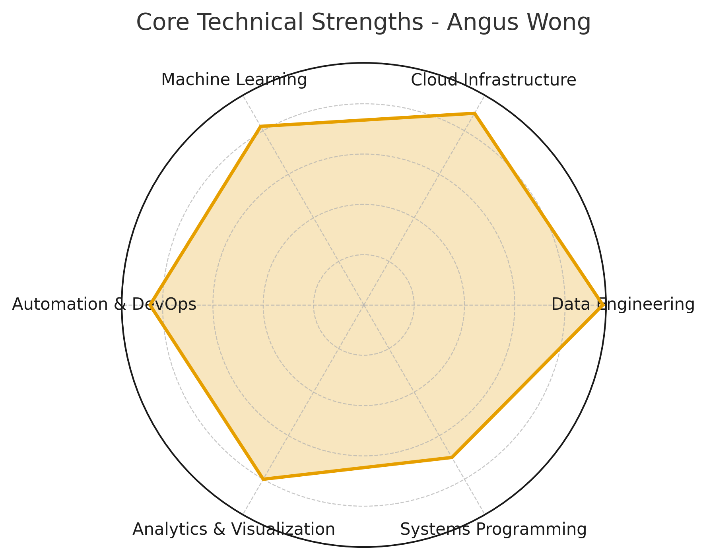

# Angus Wong

  

---

## 🧠 About Me

**Data Engineer | Cloud Architect | Automation & Systems Specialist**

I build **high-performance data infrastructure** that turns raw telemetry into live, operational insight.  
My background combines **data engineering, distributed systems, and DevOps automation**, letting me design pipelines that scale linearly, recover automatically, and drive measurable ROI.

- **Current role:** Data Engineer @ *Alabama Power Company*  
- **Core expertise:** large-scale ETL, predictive maintenance, telemetry ingestion, and low-latency cloud analytics  
- **Philosophy:** engineer systems that are **auditable, performant, and maintainable** — without unnecessary complexity  

---

## ⚙️ Core Competencies

| Domain | Technologies | Impact |
|:--------|:--------------|:--------|
| **Data Engineering** | Python, PySpark, SQL, Azure Databricks, TimescaleDB, PostgreSQL | Designed ETL pipelines ingesting 0.5 TB/day from 30 k+ sensors; reduced logistics costs by **38 %** and latency by **40 %**. |
| **Cloud Infrastructure** | Azure, AWS, GCP, Snowflake, Terraform, Databricks | Migrated large-scale telemetry database to TimescaleDB with **zero downtime**, lowering cloud spend **35 %**. |
| **Automation & DevOps** | Azure Functions, Docker, GitHub Actions, GitLab CI/CD, REST APIs | Automated SharePoint & data ingestion workflows → **80 % reduction** in manual intervention. |
| **Analytics & ML** | PySpark MLlib, Power BI, Grafana, NumPy, Pandas | Built predictive models identifying early equipment failures, cutting downtime by **26 %**. |
| **Systems Programming** | Rust, C, Ruby, Kafka, Linux, FreeBSD | Developed open-source infrastructure automation tools and optimized dataflow performance in constrained environments. |

---

## 🧩 Technical Overview

### 🛠️ **Languages**
`Python` · `SQL` · `Rust` · `C` · `Ruby`

### 📊 **Data & Analytics**
`PySpark` · `Pandas` · `NumPy` · `TimescaleDB` · `PostgreSQL` · `DuckDB` · `Power BI` · `Grafana`

### ☁️ **Cloud & Infrastructure**
`Azure` · `AWS` · `GCP` · `Snowflake` · `Databricks` · `Docker` · `Terraform` · `GitHub Actions` · `GitLab CI/CD`

### 🔄 **Automation & Orchestration**
`Azure Functions` · `REST APIs` · `CDC/CDF Workflows` · `Temporal Tables` · `Event-Driven Pipelines`

### 🧰 **Developer Environment**
`Linux (Arch, Debian, Ubuntu)` · `FreeBSD` · `Vim/Neovim` · `LaTeX` · `Netlify`

---

## 🚀 Featured Projects

### **Gamocosm.com – Minecraft On Demand**
> *Python · Ruby · Docker · CI/CD*

- Contributed to open-source automation framework that provisions and tears down Minecraft servers on-demand.  
- Built a **Python wrapper** for resource orchestration and backup automation.  
- Optimized container lifecycle to reduce hosting costs through event-driven compute.  
- Demonstrates strength in **cloud automation**, **API integration**, and **cost-aware infrastructure design**.

---

### **Predictive Maintenance & Telemetry Platform**
> *Azure Databricks · PySpark · TimescaleDB · Power BI*

- Designed **Spark-based ETL pipelines** processing 30 k+ sensor feeds at 1 Hz.  
- Integrated time-series data across **SQL Server → TimescaleDB** with Change Data Capture (CDC) for auditability.  
- Built **predictive maintenance models** detecting failure precursors — reducing maintenance spend 26 %.  
- Delivered **Grafana/Power BI dashboards** for live operational insight used by executives and engineers.

---

## 📈 Career Direction

I’m focused on **high-impact, high-compensation technical roles** such as:

- **Senior / Staff Data Engineer** — Databricks · Snowflake · Stripe · Airbnb  
- **ML Infra / MLOps Engineer** — OpenAI · Anthropic · Palantir · DeepMind  
- **Cloud Data Architect / Platform Engineer** — AWS · GCP · Cloudflare · Microsoft  

I aim to design systems that are:
- **Observable** – rich logging, metrics, and tracing baked in  
- **Reproducible** – deterministic pipelines via CI/CD and IaC  
- **Cost-efficient** – compute and storage balanced against business value  

My long-term focus is on **AI-aligned infrastructure**, bridging classical data engineering with machine learning operations.

---

## 🧾 Future Roadmap

- 🧩 **Learning:** dbt · MLflow · Airflow · AWS Glue · Terraform  
- ⚙️ **Certifications:** Databricks Data Engineer Pro | AWS Data Analytics Specialty | GCP Data Engineer  
- 🧠 **Projects to publish:**  
  - Real-time Kafka + Spark Streaming demo  
  - Data warehouse model using dbt + Snowflake  
  - MLOps pipeline (MLflow + FastAPI + Docker)  

---

## 📬 Contact

📧 **anguswong300@gmail.com**  
🌐 [anguswong.app](https://anguswong.app)  
💼 [linkedin.com/in/angus](https://linkedin.com/in/angus)  
💻 [github.com/Angus-Wong1](https://github.com/Angus-Wong1)

---

> _“Engineering is leverage. The right pipeline can replace an entire department.”_  
> — **Angus Wong**
